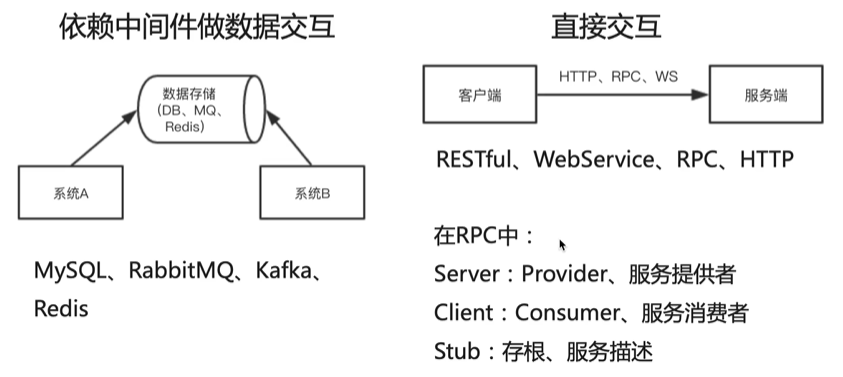
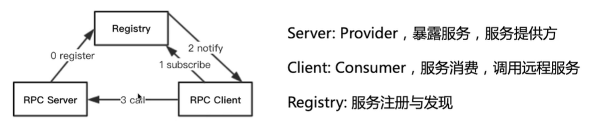
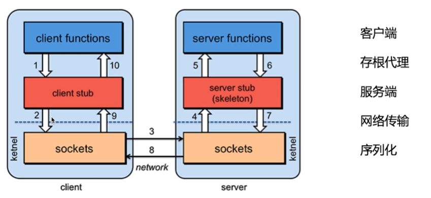
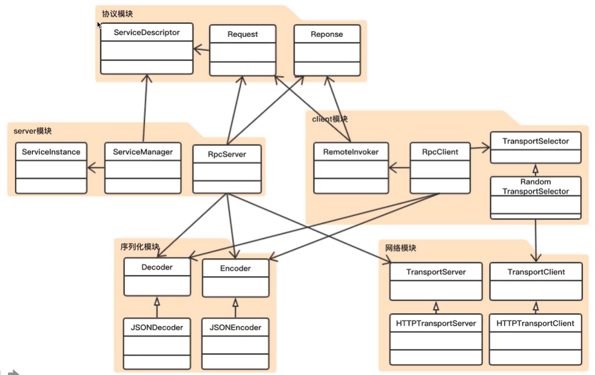

# 自己实现一个RPC框架

## RPC概念

RPC（Remote Procedure Call）即远程过程调用，基于 RPC 的通信机制试图使调用远程服务等同于调用本地服务。

跨进程交互形式：

## RPC核心原理

过程3描述：

## RPC框架核心类图

项目实现主要包括6个模块：

### 协议模块

描述Server与Client间通信的协议

- Peer类；表示网络传输的一个端点，网络通信的地址和端口
- ServiceDescriptor类；表示调用服务的信息，包括服务的类名、方法名、返回的类型以及参数类型
- Request类，表示RPC的一个请求；包括要请求的服务和参数列表
- Response类；表示RPC的一个响应， 包括服务返回编码、返回消息以及返回的数据

### 反射工具模块

ReflectionUtils类，主要包括三个方法：根据class创建对象、获取某个class的共有方法、调用指定对象的指定方法

### 序列化模块

利用fastjson来转换

- Encoder接口声明一个把对象转成二进制数组的encode方法，在JSONEncoder类中实现
- Decoder接口声明一个把二进制数组转成对象的decode方法，在JSONDecoder类中实现

### 网络模块

网络模块分为Server端和Client端，基于Http做实现（RPC中一般使用TCP长连接做网络通信），用于传输序列化后的二进制数据。

- Server端使用jetty，基于servlet接受请求，通过ServletContextHandler将Jetty与servlet连接起来，在自定义的RequestHandler中处理完请求后返回响应消息

  > 1、启动、监听
  >
  > 2、接受请求
  >
  > 3、关闭监听

- Client端使用jdk自带的URLConnection，利用getOutputStream()和getInputStream()发送和接收数据

  > 1、创建连接
  > 2、发送数据并等待响应
  > 3、关闭连接

### Server模块

- RpcServerConfig类，定义server配置，配置要使用的网络模块、序列化模块以及端口号
- ServiceInstance类，表示一个具体的服务，两个属性：服务由哪个对象提供以及哪个方法暴露成为一个服务
- ServiceManager类，管理RPC暴露的服务，两个方法：注册服务以及根据request查找服务。主要原理是通过一个Map来管理所有service实例对象，key是服务描述，value是service实例（由于服务描述是自定义的类，为了使用map.get方法，需要重写ServiceDescriptor中的equals方法）。

做单元测试时遇到的一个小Bug：JUnit使用@Before注解不生效，先查看当前引入的JUint单元测试框架版本是否5.*，如果是5版本，则使用BeforeEach替换Before注解。排查单元测试类是否继承TestCase，如果继承，则实际执行还是沿用JUnit3实现,直接删除继承即可。

- ServiceInvoker类，调用具体服务，利用反射工具类中实现的invoke方法
- RpcServer类，调用上述几个类，主要功能就是注册服务，初始化网络模块（这里需要实现RequestHandler，即获取请求信息，调用相应服务获得结果，然后将结果返回，中间涉及到反序列化和序列化），启动关闭网络模块

### Client模块

- TransportSelector接口，表示选择哪个server去连接。

  > init方法，包括了可以连接的server端点信息、client与server建立多少个连接以及实现了client网络连接接口的class
  >
  > select方法，选择一个transport与server做交互
  >
  > release方法，释放用完的client网络连接
  >
  > close方法，关闭整个selector

- RandomTransportSelector类，实现了TransportSelector接口。将所有client连接都存在一个List里，然后随机选择其中一个。另外，由于涉及了许多ArrayList的add和remove操作，为了保证线程安全，在实现接口的这些方法时都加上了synchronized关键字。
- RpcClientConfig类，定义client配置，配置要使用的网络模块、序列化模块、路由选择策略（默认随机策略）、与每个server可建立的最大连接个数以及可以连接的server端点。
- RpcClient类，加载自定义的RpcClientConfig。核心功能是通过jdk的动态代理对象，来远程调用方法。自定义一个RemoteInvoker，重写invoke方法，调用服务的流程：构造一个请求，通过网络模块把请求发送给server，等待server响应，从响应中拿到数据。

## 开发难点

### 1. Jetty嵌入

- Server，创建一个jetty的server，主要起到网络监听的作用
- ServletContextHandler，我是基于servlet来做网络处理，所以需要把ServletContextHandler注册到jetty server里去
- ServletHolder，最后还需要一个ServletHolder来托管servlet，具体的数据接收和数据写回都是在自定义的servlet里实现的

### 2. JDK动态代理

- Proxy.newProxyInstance，创建一个动态代理对象
- RemoteInvoker implements InvocationHandler，关键是invoke方法

## 不足与展望

- 安全性，没有对网络通道做校验（可考虑把http变成https，还可以对序列化做加密）
- 服务端处理能力，jetty server里面有线程池来处理client请求，但线程池最好是自己实现
- 注册中心，锦上添花，主要是方便client自动去发现server注册的地址
- 集成能力，比如嵌入SpringBoot，可以自己创建一个SpringBoot Starter，让其自动创建cliene和server，还可通过BeanFactory自动创建代理对象

